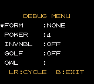

# Wario Land 3 + Debug/Cheat Menu

## What

A "Debug Menu" (more like a "Cheat Menu", really), inspired by Metroid Fusion's debug menu.

Accessible via SELECT during level play.
The menu allows cycling through:
- POWER: power-up level 0-9
- FORM: 12 transformation states (NONE/HOT/FLAT/STRNG/FAT/ELEC/PUFFY/ZOMBI/BUNCY/CRAZY/VAMPI/SNWMN)
- INVNBL: toggles invisibility on/off
- GOLF: auto-wins the current area's golf minigame. Must exit and re-enter area for it to take effect. This is currently done automatically, but it sometimes leads to soft-locking, so I'll remove it in the future, and we'll be back to having to manually exit and re-enter the area.

Navigate with UP/DOWN, cycle value with LEFT/RIGHT, exit with B.
The menu saves/restores level VRAM state via SaveBackupVRAM/LoadBackupVRAM, loads the font for display, and returns to the same level substate on exit.

Other features:
- Auto swim while holding down B rather than having to continuously press it
- Auto fly in vampire mode holding down B, same as autoswim
- Pressing SELECT while in a FORM will automatically turn you back into normal Wario first. Press SELECT again to open the DEBUG menu. This applies whenever you're in a non-normal form, regardless of whether you activated it via the DEBUG MENU or through normal gameplay.

New state ST_DEBUG_MENU ($0f) replaces the unused ST_UNUSED_0F slot.
All debug menu code auto-linked into bank $01 (646 bytes).

## Why

For fun! This is more a cheating menu than a debug menu, really. I played Wario Land 3 probably over 20 times, through and through. I still don't get tired of it. This is just another way to play it.

## How to Play

To assemble, download RGBDS (https://github.com/gbdev/rgbds/releases) and extract it to /usr/local/bin. Run `make` in your shell. The build output will be "warioland3.gbc".

## Status

Tested with [gearboy](https://github.com/drhelius/Gearboy), and played through-and-through on a real Gameboy Color with an EverDrive. The game can be played completely, without issues.

### Known Bugs

- Vampire mode, while flying, doesn't properly execute screen transitions. The "camera" stays in the current screen, even though Wario correctly moves to the proper screen. Collision occurs correctly. To "fix" this, turn into non-flying Vampire mode, or normal mode, and jump. This will cause the screen to transition. Alternatively, only use fly-mode in areas that don't have screen transitions, and use "Puffy" in areas that do.
- I tried to implement an Owl-spawning option. It spawns an owl right next to you, no matter where you are. This was completely broken in many different ways. I tried fixing it (well... Claude did), and eventually gave up. Main issues were: broken graphics in levels that don't normally have an owl (makes sense), sometimes impossible to grab the owl, and, when grabbing it and flying, completely breaking the level and sometimes crashing the game. I eventually gave up, reverted the changes, and asked Claude to write a summary of everything it tried. It's in `owl.md`. 

## How

This was entire vibe-coded. I do have 23 years of experience writing code, but I don't know ASM, and learning it to implement such features in a GB game isn't a priority of mine. I did read parts of the implementation out of curiosity, ask Claude questions about it, made small changes to see what would happen, and read the first part of https://gbdev.io/gb-asm-tutorial/index.html (highly recommended resource! extremely friendly — way friendlier than the usual learning resources for programming, in general).

I also did some debugging with Gearboy's debugging options.

My role as more QA than programming. 

Here's the whole conversation with Claude that I did to make these  changes: https://claude.ai/code/session_01F8cyT2Vr9JeFoMFFZrHiwx. I think there's value in it, which is why I'm sharing it publicly. Seeing what the AI did was a way of learning, to me, and might be, too, to GB development newbies.

## Origin

This is a fork of [ElectroDeoxys/warioland3](https://github.com/ElectroDeoxys/warioland3).
